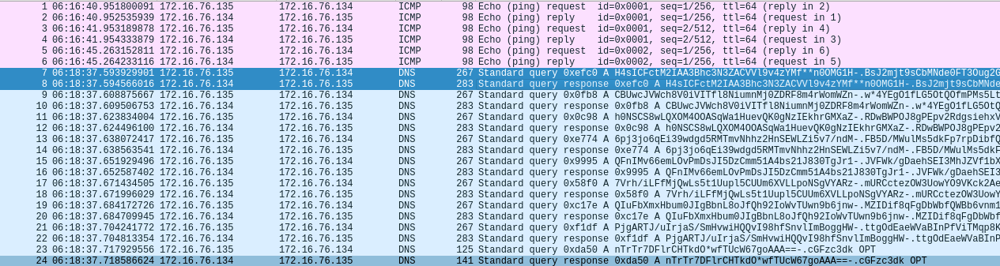

# Forensics / A l'ancienne

## Challenge :star:
> Vous devez récupérer et analyser les données échangées dans cette capture. On préfère prévenir, avant de paniquer, il va falloir se décontracter et décompresser pour faire ça tranquillement.

## Inputs
- PCAP file [cap](./cap)

## Solution
The PCAP file shows some base64 encoded data in DNS requests and replies.
The data in the DNS replies seem to be identical to the data in the corresponding request (data loopback).


Extract data from DNS requests:
```console
$ tshark -r cap -O dns -Y 'ip.src==172.16.76.135 and dns' > dns.out
```

Looks like base64, but it contains some `*`, which is a forbidden base64 symbol.
Also, we see some `-.` that look like separators.

Also we clearly see 5 pieces in the extracted data, so isolate each one in a separate file. Here is the first piece/file:
```
H4sICFctM2IAA3Bhc3N3ZACVVl9v4zYMf**n0OMG1H-.BsJ2mjt9sCbMNde0FT3Oug2GosxJY8SU7SffqRlPOv-.1nY3SHVFiqQo8icy1hjPj3wCw*IyDd*N0ulGuPquEr-.I1GiQyGAOR9s6mDkQuq1SbxmyVvkPukecwaD8u5N4d-.cGFzc3dk
CBUwcJVWch8V0iVITfl8NiumnMj0ZDRF8m4rWomWZn-.w*4YEgO1fLG5OtQOfmPMs5LtO9sGkpylqmRI7kmw7E-.H2DAgoRdZ0yTNl0VNa4aEH*EQUtSCKuRrJYH9HsBg5-.ZXxgM90uj7Ep3JJjiJuNIJ9Eins*b4jkoFzkD9S0YO-.cGFzc3dk
h0NSCS8wLQXOM4OOASqWa1HuevQK0gNzIEkhrGMXaZ-.RDwBWPOJ8gPEpv2RdgsiehxVbaYIDExtrKIiaKBU5Y-.V0HY9joN1Ehhq4XHUE8znL8hxX7pt8mL7Iz1ePb63X-.nZsp9E1Sr98*n0TRo0I7kzG1NhWAMuw3dggpCWR3Bd-.cGFzc3dk
6pj3jo6qEi39wdgd5RMTmvNhhz2HnSEWLZi5v7/ndM-.FB5D/MWulMs5dkFp7rpDibfQk79n8Y8wreUHiC6GA2-.mZ6tvcIWhE2XtTVa/S28MvoHLIM9B5fa9I5sAignc/-.4DIYMFKUx5BtjnaW1amQ78scKfovMkPhtS870TvAv*-.cGFzc3dk
QFnIMv66emLOvPmDsJI5DzCmm51A4bs21J830TgJr1-.JVFWk/gDaehSEI3MhJZVf1bXjGjyA/*65vYi9qlYje-.G9WFcxagN*efkM8Cn4WqfOPmrV6kmrhN2x/RIER0Ou-.eBjlkaJMcmrN8pCjQELcse*IsUDWLmswqQhXJTRtQq-.cGFzc3dk
7Vrh/iLFfMjQwLs5t1Uupl5CUUm6XVLLpoNSgVYARz-.mURCctezOW3UowYO9VKck2AeeDhQjiOinLOqmU64SH-.3hBOmfJ8wde0xZbnrQvqR0pXKKFskJUZ*JoN2WuXz*-.uPEUdTIXcfW*3ZvZ202piOMAtICBH8DEzZsK/AZ68W-.cGFzc3dk
QIuFbXmxHbum0JIgBbnL8oJfQh92IoWvTUwn9b6jnw-.MZIDif8qFgDbWbfQWBb6vnm1QOSimWCxNDed01il5F-.toBe*/vqyx8rFsoIw7SegxzkrgJ7qDESiioeYCDLRy-./qIlvCYZYuDBnI8jkPDIb/esvac8GNvYJBOdJepCmb-.cGFzc3dk
PjgARTJ/uIrjaS/SmHvwiHQQvI98hfSnvlImBoggHW-.ttgOdEaeWVaBInPfViTMqp8KF2RCq9jsu2akkLoFlM-.oEGCNAG8Ee8fOzJcqWqLa2XnXAgpFM8i4*v1ejnK3B-.lWLtZN3/Z5aIOT8AH68lZx8/JT9NSZSmPlUEcXiwX9-.cGFzc3dk
nTrTr7DFlrCHTkdO*wfTUcW67goAAA==-.cGFzc3dk
```

Let's assume `*` is a `+` as there's no other `+` elsewhere and `+` is a base64 allowed symbol.

In each separate piece/file, all lines end with the same: this the the base64 for `file1`, `file2`, etc.
So remove that part at the end of every line, for each piece/file.

Last thing: remove the separators `==` (not the trailing one) and the `-.` and put everything on one line like so for the first piece/file:
```
H4sICFctM2IAA3Bhc3N3ZACVVl9v4zYMf++n0OMG1HBsJ2mjt9sCbMNde0FT3Oug2GosxJY8SU7SffqRlPOv1nY3SHVFiqQo8icy1hjPj3wCw+IyDd+N0ulGuPquErI1GiQyGAOR9s6mDkQuq1SbxmyVvkPukecwaD8u5N4dCBUwcJVWch8V0iVITfl8NiumnMj0ZDRF8m4rWomWZnw+4YEgO1fLG5OtQ\
OfmPMs5LtO9sGkpylqmRI7kmw7EH2DAgoRdZ0yTNl0VNa4aEH+EQUtSCKuRrJYH9HsBg5ZXxgM90uj7Ep3JJjiJuNIJ9Eins+b4jkoFzkD9S0YOh0NSCS8wLQXOM4OOASqWa1HuevQK0gNzIEkhrGMXaZRDwBWPOJ8gPEpv2RdgsiehxVbaYIDExtrKIiaKBU5YV0HY9joN1Ehhq4XHUE8znL8hxX7pt8\
mL7Iz1ePb63XnZsp9E1Sr98+n0TRo0I7kzG1NhWAMuw3dggpCWR3Bd6pj3jo6qEi39wdgd5RMTmvNhhz2HnSEWLZi5v7/ndMFB5D/MWulMs5dkFp7rpDibfQk79n8Y8wreUHiC6GA2mZ6tvcIWhE2XtTVa/S28MvoHLIM9B5fa9I5sAignc/4DIYMFKUx5BtjnaW1amQ78scKfovMkPhtS870TvAv+QFn\
IMv66emLOvPmDsJI5DzCmm51A4bs21J830TgJr1JVFWk/gDaehSEI3MhJZVf1bXjGjyA/+65vYi9qlYjeG9WFcxagN+efkM8Cn4WqfOPmrV6kmrhN2x/RIER0OueBjlkaJMcmrN8pCjQELcse+IsUDWLmswqQhXJTRtQq7Vrh/iLFfMjQwLs5t1Uupl5CUUm6XVLLpoNSgVYARzmURCctezOW3UowYO9V\
Kck2AeeDhQjiOinLOqmU64SH3hBOmfJ8wde0xZbnrQvqR0pXKKFskJUZ+JoN2WuXz+uPEUdTIXcfW+3ZvZ202piOMAtICBH8DEzZsK/AZ68WQIuFbXmxHbum0JIgBbnL8oJfQh92IoWvTUwn9b6jnwMZIDif8qFgDbWbfQWBb6vnm1QOSimWCxNDed01il5FtoBe+/vqyx8rFsoIw7SegxzkrgJ7qDESi\
ioeYCDLRy/qIlvCYZYuDBnI8jkPDIb/esvac8GNvYJBOdJepCmbPjgARTJ/uIrjaS/SmHvwiHQQvI98hfSnvlImBoggHWttgOdEaeWVaBInPfViTMqp8KF2RCq9jsu2akkLoFlMoEGCNAG8Ee8fOzJcqWqLa2XnXAgpFM8i4+v1ejnK3BlWLtZN3/Z5aIOT8AH68lZx8/JT9NSZSmPlUEcXiwX9nTrTr7\
DFlrCHTkdO+wfTUcW67goAAA==
```

So we end up with five base64 encoded files that we can base64 decode with no error:
```console
$ file *.b64
file1.b64: ASCII text, with very long lines, with no line terminators
file2.b64: ASCII text, with very long lines, with no line terminators
file3.b64: ASCII text, with very long lines, with no line terminators
file4.b64: ASCII text, with very long lines, with no line terminators
file5.b64: ASCII text, with very long lines, with no line terminators
$ for file in $(ls); do base64 -d $file > $file.dec; done
```

After Base64 decoding them, we get gzip files:
```console
$ file *.dec
file1.b64.dec: gzip compressed data, was "passwd", last modified: Thu Mar 17 12:45:11 2022, from Unix, original size modulo 2^32 2798
file2.b64.dec: gzip compressed data, was "file1", last modified: Thu Mar 17 16:31:54 2022, from Unix, original size modulo 2^32 131579
file3.b64.dec: gzip compressed data, was "file3", last modified: Thu Mar 17 16:33:19 2022, from Unix, original size modulo 2^32 12654
file4.b64.dec: gzip compressed data, was "file4", last modified: Thu Mar 17 16:31:00 2022, from Unix, original size modulo 2^32 4231
file5.b64.dec: gzip compressed data, was "file2", last modified: Thu Mar 17 16:32:21 2022, from Unix, original size modulo 2^32 11404
```

After Gunzipping them, we finally get interesting files:
```console
$ for file in $(ls *.dec); do mv $file $file.gz; done
$ gunzip *.gz
$ file *.dec
file1.b64.dec: ASCII text
file2.b64.dec: JPEG image data, JFIF standard 1.01, aspect ratio, density 1x1, segment length 16, baseline, precision 8, 1667x1667, components 3
file3.b64.dec: PNG image data, 80 x 80, 8-bit/color RGBA, non-interlaced
file4.b64.dec: Microsoft Word 2007+
file5.b64.dec: JPEG image data, baseline, precision 8, 181x66, components 4
```

The flag waits for us in the Microsoft Word file.

## Flag
FCSC{18e955473d2e12feea922df7e1f578d27ffe977e7fa5b6f066f7f145e2543a92}
