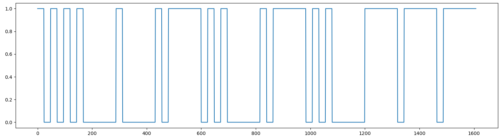
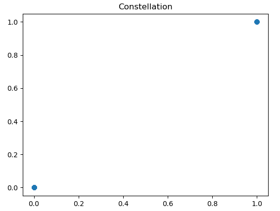
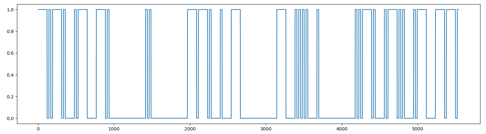

# Hardware / Daddy morse

## Challenge :star:
Les télégraphes Morse permettaient d'échanger des messages de texte à longue distance, en encodant un message sous forme d'impulsions électriques. Le serveur se comporte comme un mini-télégraphe et décode les données que vous lui envoyez.

Vous devez envoyer CAN I GET THE FLAG.

Vous avez le code du serveur ainsi qu'un exemple de message à disposition.

Les paramètres de transmission sont les suivants :

    fréquence d'échantillonage : 24kHz
    durée d'un . : 1 milliseconde
    durée d'un - : 5 millisecondes
    espacement entre deux lettres : 5 millisecondes
    espace entre deux mots : 20 millisecondes

## Inputs
- server: `challenges.france-cybersecurity-challenge.fr:2251`
- signal: IQ data [signal.iq](./signal.iq)
- client: [client.py](./client.py)
- server: [server.py](./server.py)

## Example signal
Let's first quickly plot the signal with following python code:
```python
import numpy as np
import matplotlib.pyplot as plt

signal = np.fromfile("signal.iq", dtype = np.complex64)

plt.plot(np.real(signal))
plt.show()

plt.scatter(np.real(signal), np.imag(signal))
plt.title("Constellation")
plt.show()
```



It looks like the signal matches the description and we can read the morse data: `.... . .-.. .-.. ---`, which means `HELLO`. Also, the duration between two symbols is the same as the `.` duration (1ms).

The constellation shows a clean two-state modulation `0` and `1+1j`:


## Solution
To send message `CAN I GET THE FLAG`, we'll follow these steps:
- Morse encoding
- IQ data generation, using the two-state `0` and `1+1j` as in the example signal

Morse encoding, using the alphabet given in the server code. We'll use `_` for separator between two letters and a space for a space between words:
```python
alphabet = { 'A':'.-', 'B':'-...',
            'C':'-.-.', 'D':'-..', 'E':'.',
            'F':'..-.', 'G':'--.', 'H':'....',
            'I':'..', 'J':'.---', 'K':'-.-',
            'L':'.-..', 'M':'--', 'N':'-.',
            'O':'---', 'P':'.--.', 'Q':'--.-',
            'R':'.-.', 'S':'...', 'T':'-',
            'U':'..-', 'V':'...-', 'W':'.--',
            'X':'-..-', 'Y':'-.--', 'Z':'--..',
            '1':'.----', '2':'..---', '3':'...--',
            '4':'....-', '5':'.....', '6':'-....',
            '7':'--...', '8':'---..', '9':'----.',
            '0':'-----', ', ':'--..--', '.':'.-.-.-',
            '?':'..--..', '/':'-..-.', '-':'-....-',
            '(':'-.--.', ')':'-.--.-'}

def morse_encode(msg):
    res = ""
    for word in msg.split(" "):
        for letter in word:
            if letter in alphabet:
                res += alphabet[letter]
            elif letter == "":
                continue
            else:
                return "error"
            res += "_"
        res += " "
    return res
```

Here is the Morse encoded message for `CAN I GET THE FLAG`:
```
-.-._.-_-._ .._ --._._-_ -_...._._ ..-._.-.._.-_--._
```

Next, generate the IQ data, considering two states `1+1j` for `.` and `-` and `0` for separators (between symbols, between letters, between words) and considering 24kHz sampling rate :
- DOT = 1/1000 *24kHz = 24 samples (same for separation between symbols)
- DASH = 5/1000 = 120 samples
- SEP_LETTER = 5/1000 = 120 samples
- SPACE = 20/1000 = 240 samples

Only thing we need to take care is to not cumulate two separators one after the other.

```python
def am_encode(morse):
    iqs = []
    cur = morse[0]

    for i in range(len(morse[1::])):
        new = morse[i]
        if new != "_" and cur != "_" and new != " " and cur != " " and i != 0:
            nb = int(TIMING_DOT * SAMP_RATE)
            iqs += [0j] * nb
        if new == ".":
            nb = int(TIMING_DOT * SAMP_RATE)
            iqs += [1+1j] * nb
        elif new == "-":
            nb = int(TIMING_DASH * SAMP_RATE)
            iqs += [1+1j] * nb
        elif new == "_":
            if i != len(morse[1::]):
                if morse[i+1] != " ":
                    nb = int(TIMING_SEP_LETTER * SAMP_RATE)
                    iqs += [0j] * nb
        elif new == " ":
            nb = int(TIMING_SPACE * SAMP_RATE)
            iqs += [0j] * nb
        cur = new

    return iqs
```

So let's generate our signal and store it in `signal2.iq` so we can plot it. Last thing to do is to base64 encode the signal before submitting it to the target:

```python
msg = "CAN I GET THE FLAG"
signal = np.array(am_encode(morse_encode(msg)), dtype = np.complex64)

with open("signal2.iq", "wb") as f:
    f.write(signal)

b64 = base64.b64encode(signal).decode()
print(b64)
```

Here's the plotted signal, which looks promising!


Let's submit it to the server:
```console
$ python3 sol.py > sig.b64.txt
$ nc challenges.france-cybersecurity-challenge.fr 2251 < sig.b64.txt
signal > Well done: FCSC{e8b4cad7d00ca921eb12824935eea3b919e5748264fe1c057eef4de6825ad06c}
```

## Python code
Complete solution in [sol.py](./sol.py)

## Flag
FCSC{e8b4cad7d00ca921eb12824935eea3b919e5748264fe1c057eef4de6825ad06c}
