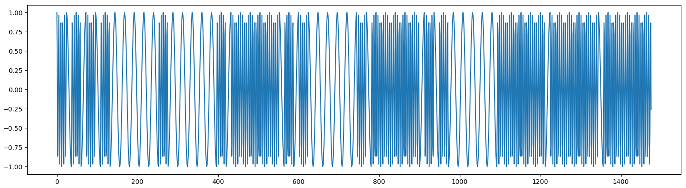
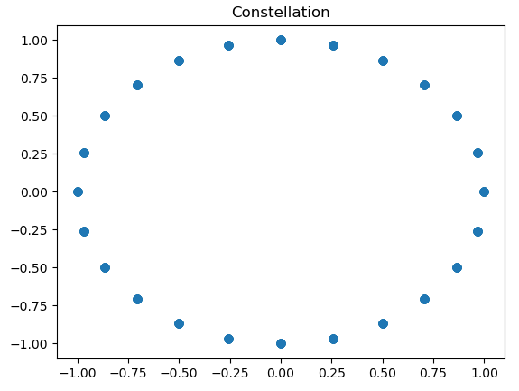
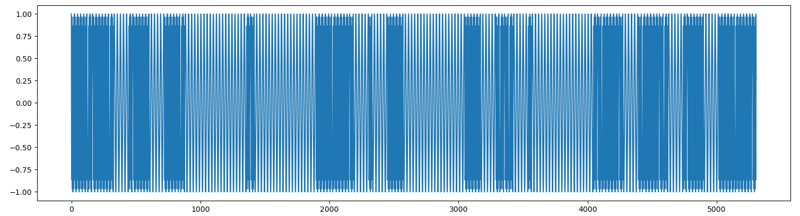
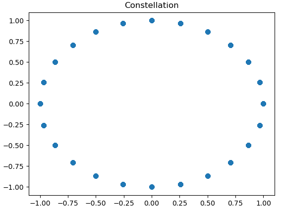

# Hardware / Mommy morse

## Challenge :star::star:
On vous demande d'envoyer un message en Morse avec une modulation de fréquence à deux états. Le codage choisi est que les . et - sont représentés par une porteuse pure à une fréquence de 5kHz, et les espacements sont représentés par une porteuse pure à une fréquence de 1kHz.

Vous devez envoyer CAN I GET THE FLAG.

Vous avez le code du serveur ainsi qu'un exemple de message à disposition.

Les paramètres de transmission sont les suivants :

    fréquence d'échantillonage : 24kHz
    envoi d'un . : porteuse pure de fréquence 5kHz pendant 1 milliseconde
    durée d'un - : porteuse pure de fréquence 5kHz pendant 5 millisecondes
    espacement entre deux lettres : porteuse pure de fréquence 1kHz pendant 5 millisecondes
    espace entre deux mots : porteuse pure de fréquence 1kHz pendant 20 millisecondes


## Inputs
- server: `challenges.france-cybersecurity-challenge.fr:2252`
- signal: IQ data [signal.iq](./signal.iq)
- client: [client.py](./client.py)
- server: [server.py](./server.py)

## Example signal
Let's first quickly plot the signal with following python code:
```python
import numpy as np
import matplotlib.pyplot as plt

signal = np.fromfile("signal.iq", dtype = np.complex64)

plt.plot(np.real(signal))
plt.show()

plt.scatter(np.real(signal), np.imag(signal))
plt.title("Constellation")
plt.show()
```




## Solution
To send message `CAN I GET THE FLAG`, we'll follow these steps:
- Morse encoding, same as in the `Daddy Morse` challenge
- IQ data generation

Next, generate the IQ data, considering a 5kHz frequency for `.` and `-`, a 1kHz frequency for separators and also considering 24kHz sampling rate :
- DOT = 1/1000 *24kHz = 24 samples (same for separation between symbols)
- DASH = 5/1000 = 120 samples
- SEP_LETTER = 5/1000 = 120 samples
- SPACE = 20/1000 = 240 samples

To generate the signal, I reverted the code from the server:
```python
    # Get instantaneous frequency
    freq = np.diff(np.unwrap(np.angle(s)))
    freq = (SAMP_RATE / (2*np.pi)) * freq
```

Which I reverted as follow:
```python
    freqs_diff = [ ((2*np.pi) / SAMP_RATE) * f for f in freq ]
    phases = np.concatenate(([0.0, freqs_diff[0]], freqs_diff)).cumsum()
    angles = (phases + np.pi) % (2 * np.pi) - np.pi
    iqs = np.exp(1j*angles)
```

Here is the full signal encoding:
```python
def fm_encode(morse):
    timings = []
    freqs = []
    cur = morse[0]

    for i in range(len(morse[1::])):
        new = morse[i]
        if new != "_" and cur != "_" and new != " " and cur != " " and i != 0:
            freqs += [FREQ_LOW] * int(TIMING_DOT * SAMP_RATE / 2)
        if new == ".":
            freqs += [FREQ_HIGH] * int(TIMING_DOT * SAMP_RATE)
        elif new == "-":
            freqs += [FREQ_HIGH] * int(TIMING_DASH * SAMP_RATE)
        elif new == "_":
            if i != len(morse[1::]):
                if morse[i+1] != " ":
                    freqs += [FREQ_LOW] * int(TIMING_SEP_LETTER * SAMP_RATE)
        elif new == " ":
            freqs += [FREQ_LOW] * int(TIMING_SPACE * SAMP_RATE)
        cur = new

    freqs_diff = [ ((2*np.pi) / SAMP_RATE) * f for f in freqs ]
    phases = np.concatenate(([0.0, freqs_diff[0]], freqs_diff)).cumsum()
    angles = (phases + np.pi) % (2 * np.pi) - np.pi
    iqs = np.exp(1j*angles)
    return iqs
```

So let's generate our signal and store it in `signal2.iq` so we can plot it. Last thing to do is to base64 encode the signal before submitting it to the target:

```python
msg = "CAN I GET THE FLAG"
signal = np.array(fm_encode(morse_encode(msg)), dtype = np.complex64)

with open("signal2.iq", "wb") as f:
     f.write(signal)

b64 = base64.b64encode(signal).decode()
print(b64)
```

Here's the plotted signal and constellation, which look ok:



Let's submit it to the server:
```console
$ python3 sol.py > sig.b64.txt
$ nc challenges.france-cybersecurity-challenge.fr 2252 < sig.b64.txt
signal > Well done: FCSC{490b88345a22d35554b3e319b1200b985cc7683e975969d07841cd56dd488649}
```

## Python code
Complete solution in [sol.py](./sol.py)

## Flag
FCSC{490b88345a22d35554b3e319b1200b985cc7683e975969d07841cd56dd488649}
