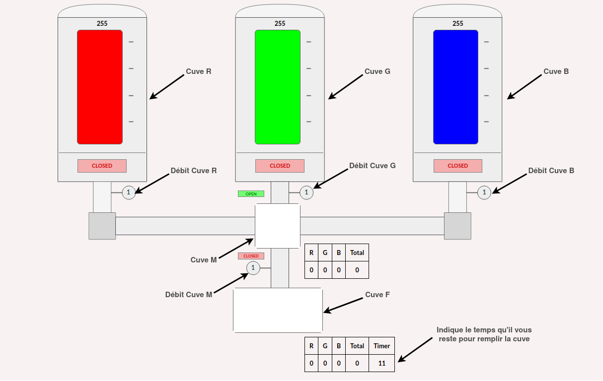

# Misc / Color plant 1

## Challenge :star:
> Dans cette première partie du challenge Color Plant, vous manipulez une usine en production dans un système industriel via le procotole industriel Modbus. La première étape de ce challenge est de récupérer un token présent dans les registres de l'automate afin de pouvoir accèder à l'interface web SCADA. Pour cela, vous devez lire dans les registres de l'automate à l'aide du protocole Modbus et tenter de réassembler un token valide. Vous pourrez alors continuer la deuxième partie de l'épreuve.

## Inputs
- Description of how the color plant works `https://france-cybersecurity-challenge.fr/pheidee8ooPee3eghoo3ooh3sae0ooLo`
- Entry point to the color plant `challenges.france-cybersecurity-challenge.fr:502`
- SCADA Web interface for the plant `https://color-plant.france-cybersecurity-challenge.fr`

## Solution
Here is the color plan overall description:


We need to interact with valves to fill/empty various tanks, everything being controlled via protocol `Modbus`.
As suggested, we'll use python lib `ModbusClient`.

First we need to open a TCP connection with the server on port 502 like so:
```python
c = ModbusClient(host="challenges.france-cybersecurity-challenge.fr", port=502, auto_open=True)
```

Then we need to get a token from the colorplant state by reading `Modbus` Holding registers 0 to 31.
So we'll read the 32 registers starting at address 0, using API call `read_holding_registers(0, 32)`:
```python
token = c.read_holding_registers(0, 32)
```

Here I thought the first flag was the token itself, inside `FCSC{}` format. I spent a lot of time there, trying various formats, like in reverse, hex, etc. But instead, the token was to be submitted to the SCADA web interface. RTFM!

When the token is accepted, we enter the web interface showing the tanks, the valves and so on. Pretty slick. Also, the first flag is displayed at the top.

## Python code
Complete solution in [sol.py](./sol.py)

## Flag
FCSC{266350f412840c932b29bb095394d318c17c844f70c05f49c9998a8e614be531}
